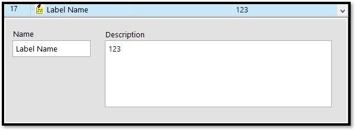
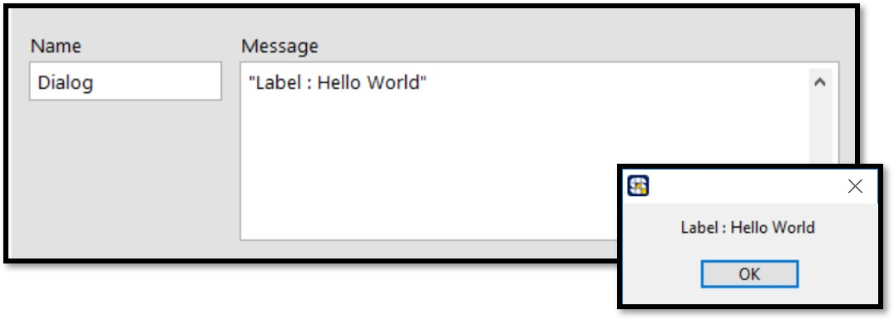
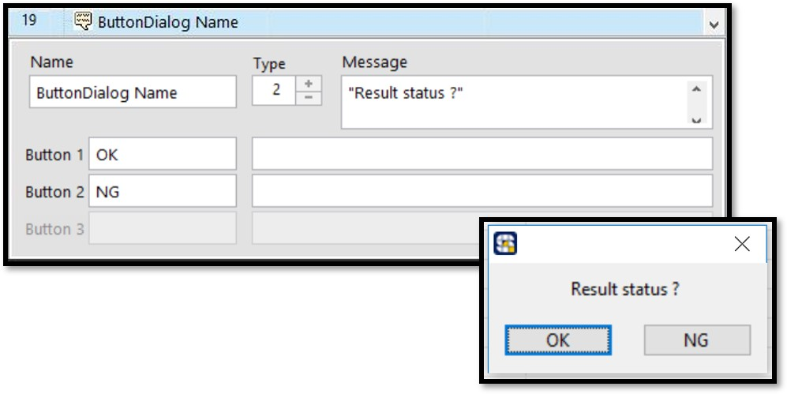

# 一般函式

#### \# 標籤\(Label\)

使用於線程的說明與註解，方便程式的閱讀與維護，在線程運作時不會執行，進階功能可做為Action函式的指向目標進行Goto的跳躍。

| 設定參數 | 參數說明 |
| :--- | :--- |
| 名稱\(Name\) | 步驟名稱，可自訂 |
| 內容\(Description\) | 說明與註解 |

#### \# 對話框\(Dialog\)

在流程運作中跳出對話視窗，常用於警告使用者軟硬體異常，在對話框出現的期間流程會暫停。

<table>
  <thead>
    <tr>
      <th style="text-align:left">設定參數</th>
      <th style="text-align:left">參數說明</th>
    </tr>
  </thead>
  <tbody>
    <tr>
      <td style="text-align:left">名稱(Name)</td>
      <td style="text-align:left">步驟名稱，可自訂</td>
    </tr>
    <tr>
      <td style="text-align:left">訊息(Message)</td>
      <td style="text-align:left">
        
顯示於對話框中的文字

        
。直接輸入 : "訊息內容"

        
。字串變數 : Local.變數名稱

        
。數值變數 : str("Local.變數名稱")

      </td>
    </tr>
  </tbody>
</table>

#### \# 按鈕對話框\(Button Dialog\)

在流程運作中跳出有選項的對話視窗，可依照操作員的選擇執行不同的程式\(表達式\)，在對話框出現的期間流程會暫停，最多支援三個按鈕選項。

<table>
  <thead>
    <tr>
      <th style="text-align:left">設定參數</th>
      <th style="text-align:left">參數說明</th>
    </tr>
  </thead>
  <tbody>
    <tr>
      <td style="text-align:left">名稱(Name)</td>
      <td style="text-align:left">步驟名稱，可自訂</td>
    </tr>
    <tr>
      <td style="text-align:left">模式(Type)</td>
      <td style="text-align:left">選擇按鈕的數量</td>
    </tr>
    <tr>
      <td style="text-align:left">訊息(Message)</td>
      <td style="text-align:left">
        
顯示於對話框中的文字

        
。直接輸入 : "訊息內容"

        
。字串變數 : Local.變數名稱

        
。數值變數 : str("Local.變數名稱")

      </td>
    </tr>
    <tr>
      <td style="text-align:left">按鈕 1(Button 1)</td>
      <td style="text-align:left">按鈕1參數，左側為按鈕上的文字，
         右側為按下後執行的程式，程式內
         容請參考下方Expression函式說明。</td>
    </tr>
    <tr>
      <td style="text-align:left">按鈕 2(Button 2)</td>
      <td style="text-align:left">
        
按鈕2參數，左側為按鈕上的文字，

        
右側為按下後執行的程式，程式內

        
容請參考下方Expression函式說明。

      </td>
    </tr>
    <tr>
      <td style="text-align:left"></td>
      <td style="text-align:left">
        
按鈕3參數，左側為按鈕上的文字，

        
右側為按下後執行的程式，程式內

        
容請參考下方Expression函式說明。

      </td>
    </tr>
  </tbody>
</table>

#### \# 表達式\(Expression\)

能夠進行變數的寫入以及運算，若在同一個Expression中執行多個表達式運算時，可以用分 號\[;\]進行分隔。

<table>
  <thead>
    <tr>
      <th style="text-align:left">設定參數</th>
      <th style="text-align:left">參數說明</th>
    </tr>
  </thead>
  <tbody>
    <tr>
      <td style="text-align:left">名稱(Name)</td>
      <td style="text-align:left">步驟名稱，可自訂</td>
    </tr>
    <tr>
      <td style="text-align:left">表達式(Expression)</td>
      <td style="text-align:left">
        
程式內容

        
。數值變數 : Local.變數名稱=Local.變數名稱+5

        
。布林變數 : Local.變數名稱＝True

        
。字串變數 : Local.變數名稱="文字內容"

        
。字串疊加 : Local.變數名稱=Local.變數名稱+"文字內容"

      </td>
    </tr>
  </tbody>
</table>

#### \# 等待\(Wait\)

#### \# 標準時間\(Time String\)

