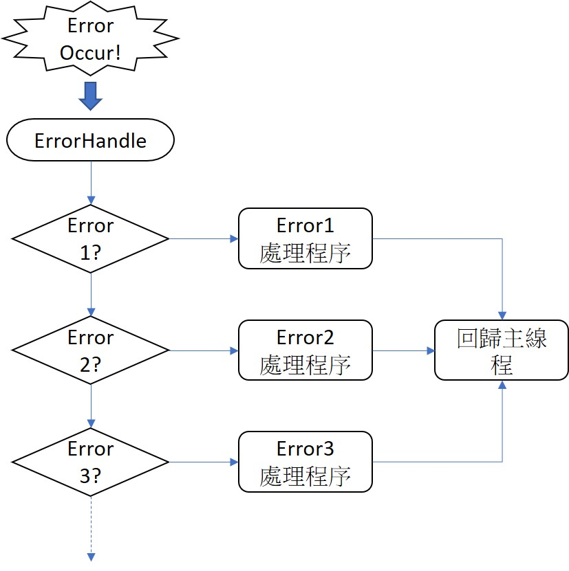
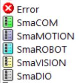
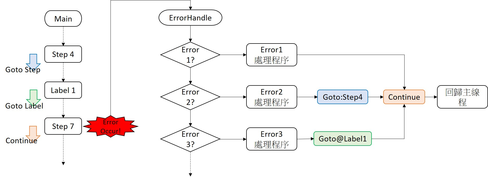

# 流程中的錯誤處理\(ErrorHandle\)

SmaSEQ 2.0 提供讓使用者自定義錯誤發生時的處理方式，當線程運作的過程中出現錯誤時，設備動作會暫停並且自動進入錯誤排除的程序或是跳出警告視窗來告知操作員錯誤生的原因。

錯誤處理的方法由線程大綱中的ErrorHandle負責管理，建議將ErrorHandle中的程式編寫為以下架構，首先透過If...ElseIf...End的判斷式找到發生的錯誤種類，接著軟體會依照該判斷式裡面的流程來進行錯誤排除的動作，最後則是設定錯誤排除後機台要如何繼續運作。

#### \# Step 1 : 進入ErrorHandle程序

進入錯誤處理程序的方式有2種，一種是使用模組相關的流程函式\(SmaCOM、SmaVISION等函式\)時遇到如無法連線或是運行錯誤之類的狀況需要排除錯誤，另一種方式是經由流程函式Error，讓使用者自定義錯誤發生的狀況並予以排除。兩者的設定方式都是透過函式中的Error Action欄位設定錯誤的名稱，錯誤名稱會在軟體底層經由Error.Action變數傳遞給ErrorHandle，接著讓Step 2進行判斷。

#### \# Step 2 : 判斷錯誤類別

當主線程運作過程中發生問題並傳來Error.Action變數後，此時在ErrorHandle中要透過If...ElseIf...End的判斷式找出與錯誤名稱對應的排除方式，判斷式的語法為\[Error.Action="錯誤名稱"\]，設定方式請參考\[[函數的功能與參數設定方式](liu-cheng-han-shi/han-de-gong-neng-ding-fang-shi/)\]。

#### \# Step 3 : 回歸主線程

當錯誤排除的流程已經完成後，使用者可以自行設定下一步的動作要如何進行，此時要藉助流程函式Action來指定回歸主線程的程式位置，讓程式由該位置繼續執行下面的動作，Action函式能夠進行以下的操作 : 

* Continue : 回歸到錯誤發生的步驟繼續執行流程。
* Pause : 進入流程暫停的狀態。
* Goto : 回歸到使用者指定的程式位置。
* Cleanup : 進入Cleanup流程。
* Abort : 直接終止流程。

在上述的操作中，Goto的使用方式可以細分為2種，第一種是選擇特定流程的特定步驟，如:Main的Step 5、Setup 的 Step 9等方式，第二種方法是選擇特定的Label流程函式進行跳躍，輸入格式為\[流程@Label名稱\]，例如:Setup@Label3、Main@Label6，詳細的設定方式可以參考\[[函數的功能與參數設定方式](liu-cheng-han-shi/han-de-gong-neng-ding-fang-shi/)\]。

另外需要注意的是Action的Goto只是改變流程繼續執行的位置，必須要再加入Action的Continue流程才會繼續運作。

