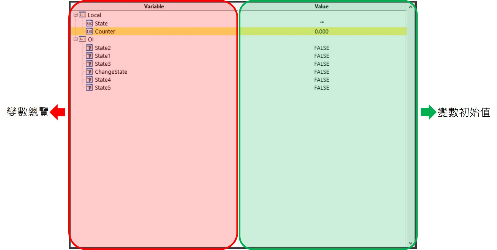

# Variable - 變數表

## 何謂變數？

#### 在 SmaSEQ 中，所有數值、狀態的資料，都是用「變數」進行傳遞的。

在專案開發的過程中，有些資料是我們需要保存下來，作為後續判斷的依據，例如影像的判讀結果、流程的運行狀態......等；為了滿足這項需求，我們建立了變數機制，用來接收、紀錄、傳遞各式各樣的資料。

## 版面配置與變數群組

### \# 變數表介面

變數表主要分為兩個區塊，左側為變數的類型與名稱，右側是變數的初始值。

有關變數的資料類型，請參閱《變數表的基本功能》

### \# 變數群組 \( Local / OI \)

每個 Sequencer 在建立時，都會自動產生 Local、OI 兩個變數群組。

* **Local 群組：**建立在 Local 群組下的變數可提供資料的保存與傳遞功能，並運作在流程背景中。
* **OI 群組：**OI 群組的變數，必須在**操作員介面設定模式下建立**才有效。流程執行時，OI 數值會直接顯示在操作員介面中 \(Operator Interface\)。關於操作員介面的設定，請參閱《設計您的操作員介面》。

## 

