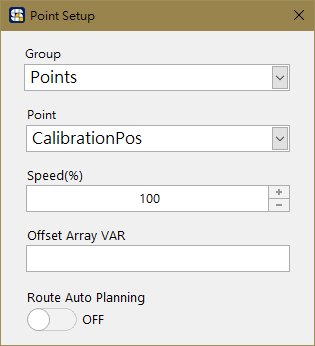
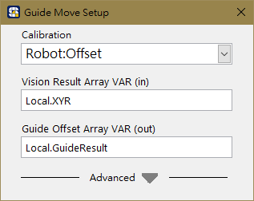
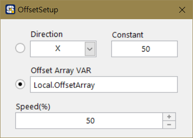
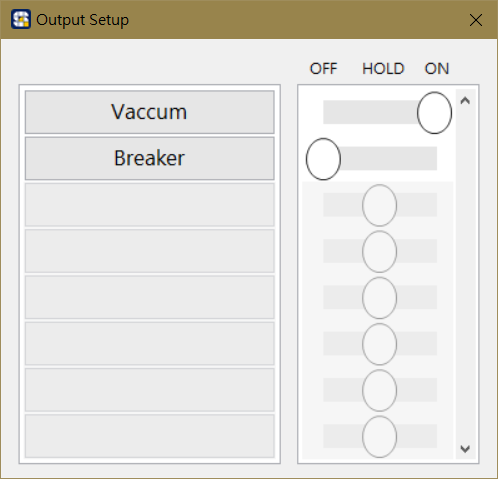
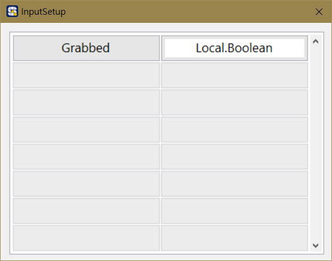

# 命令機械手臂模組【SmaROBOT】

### 命令指定的 SmaROBOT Module 執行動作指令。

| 參數 | 說明 |
| :--- | :--- |
| Module | 選擇要命令的模組。 |
| Method | 選擇動作指令。 |
| Error Action | 命名錯誤名稱。當此步驟發生錯誤時，將紀錄此名稱。 |
| Timeout | 設定等待時間，超過時間會觸發超時錯誤，進入錯誤處理程序 |
| Command | 模組執行的動作，直接點擊右側的編輯標籤進行設定 |


有關 Error Action 欄位名稱的具體功能，請參考《在 ErrorHandle 編輯專案的錯誤處理流程》


## Method 動作指令與語法

### &lt; Points &gt;，指定手臂模組中已儲存的座標點，命令手臂移動到該點。

* **Command：**
  * 使用右側的編輯標籤，指定座標點，並提供相關的指令參數
    *  Group（群組）：座標點所屬的群組。只有 「Point」 與 「Pallet」 兩種。
    * Point（座標點）：選擇座標點的名稱。座標點需預先在 SmaROBOT 模組定義。
    * Speed（速率百分比）：手臂移動時的速度比率。基礎速度在 SmaROBOT 模組中定義。
    * Offset Array VAR（補償陣列變數）：目標座標點的偏移量。此欄位為選擇性填入。
    * Route Auto Planning（路由規劃）：命令手臂必須依照座標路由表移動，若無找不到路徑則無法運行。座標路由表在 SmaROBOT 模組中，由使用者自行定義。


有關座標路由表的功能與設定，請參考《SmaROBOT模組 - 自動路徑規劃》


### &lt; VisionGuide &gt;，進行視覺導引運算

* **Command：**
  * 使用右側的編輯標籤，指定座標關係模型，並提供輸入變數陣列與輸出變數陣列。
    *  Calibration（座標關係模型）：指定座標換算模型。使用此功能須先經過視覺導引設定。
    * Vision Result Array VAR \(in\)（視覺輸出座標）：指定機器視覺所得到的座標值，作為座標換算的輸入陣列。此欄位需給予一維陣列，大小為三，分別代表 \[ 座標 X , 座標 Y , 角度 R\]。
    * Guide Offset Array VAR \(out\)（導引補償座標）：指定一個陣列變數，接收座標模型換算得到的結果。此欄位需給予大小為六的一維陣列，分別代表 \[ X , Y , Z , U , V , W\]，是為補償陣列。


有關視覺導引的功能說明，請參考《SmaROBOT模組 - 視覺導引》


### &lt; Offset &gt;，命令手臂移動指定的方向與值

* **Command：**
  * 使用右側的編輯標籤，指定位移的方式，可以是單向移動，或是以陣列變數多向移動。
    * Option 1
      * Direction（移動方向）：依照手臂的座標系，可以為 X, Y, Z, U, V, W。
      * Constant（視覺輸出座標）：移動的數值。以 Millimeter 或 Degree 為單位。
    * Option 2
      * Offset Array VAR（補償陣列變數）：指定一維陣列變數作為移動量，陣列大小為六，分別代表 \[ X , Y , Z , U , V , W\]。
    * Speed（速率百分比）：手臂移動時的速度比率。基礎速度在 SmaROBOT 模組中定義。

### &lt; CheckDone &gt;，等待手臂完成上一個移動指令

* **無參數設定**


若要確認手臂是否完成移動，請加入 CheckDone 步驟


### &lt; WriteDO &gt;，**改變手臂控制器的數位輸出訊號**

* **Command：**
  * 使用右側的編輯標籤，指定 DO 的狀態，可為 On / Hold / Off。DO 的名稱在 SmaROBOT 模組中由使用者自行定義。
    *  On - 數位訊號變為 True
    * Hold - 數位訊號保持原本狀態
    * Off - 數位訊號變為 False


關於 SmaROBOT 的 DIO 設定方式，請參考《SmaROBOT模組 - 手臂控制器 DIO》


### &lt; ReadDI &gt;，**讀取手臂控制器當下的數位輸入訊號**

* **Command：**
  * 使用右側的編輯標籤，為需要紀錄的 DI 訊號指派 Boolean 變數。DI 的名稱在 SmaROBOT 模組中由使用者自行定義。

### &lt; WaitUntil &gt;，**等待手臂控制器的數位輸入訊號變為期望的狀態**

* **Command：**
  * 使用右側的編輯標籤，指定 DI 訊號點，與期望的訊號狀態。DI 的名稱在 SmaROBOT 模組中由使用者自行定義。

