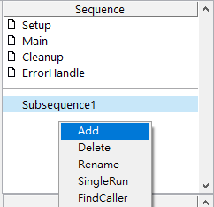
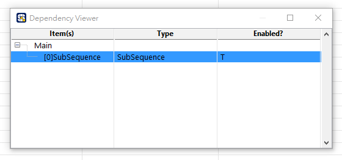
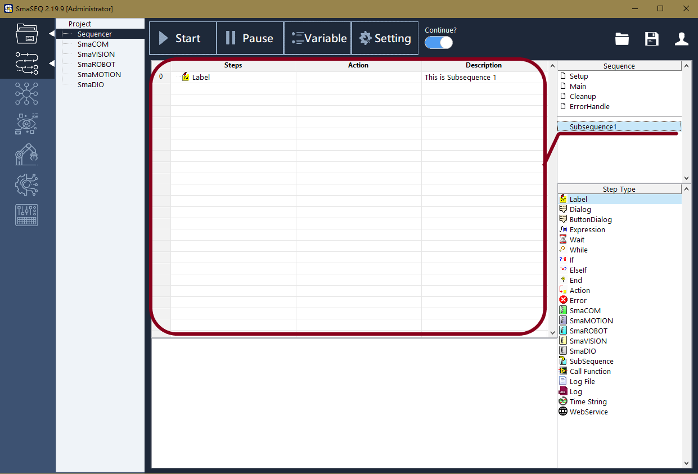

# 善用 Subsequence，讓專案流程更易讀更彈性

#### Subsequence 為子流程，是使用者可以自行定義的執行續。根據被指定運行的方式不同，子流程的靈活運用可在專案開發時，為我們帶來多項效益。

## 功能與效益

### 簡化（Sequential sub-sequence）

* **重複的流程不用一寫再寫。**

將會「重複使用」的流程，編放在 Subsequence 中，當主流程需要執行時，直接呼叫這個子流程即可。

### 同動（Parallel sub-sequence）

* **平行下達動作指令。**

當我們需要同時下達多種指令時，為了提高效率，我們可將欲「平行處理」的流程，編寫在子流程中。當主流程進行到需要使用這些指令的階段時，再以平行方式呼叫該子流程。

### 多工（Auto-Run sub-sequence）

* **獨立運作的執行續。**

若一個獨立執行續 Main Thread 無法滿足需求，可編輯獨立的子流程，以自動運行的指令呼叫該子流程。

欲瞭解 Subsequence 如何被呼叫以及指定運作方式，請參閱《[進階步驟函式](../liu-cheng-han-shi/han-de-gong-neng-ding-fang-shi/jin-jie-han-shi.md)》



## 建立與編輯

#### 滑鼠右鍵點擊 Sequence 窗格的下半部，即可開啟 Subsequence 的操作選單

* Add：新增一項子流程
* Delete：刪除指定的子流程
* Rename：重新命名指定的子流程
* SingleRun：單獨運行指定的子流程
* FindCaller：尋找「呼叫該子流程」的步驟。如下圖所示。

#### 左鍵點擊選擇子流程，即可開始編輯

