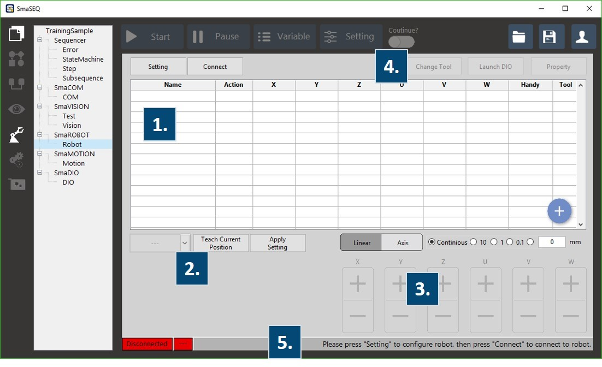

# SmaROBOT 機械手臂模組

#### 機械手臂已然成為業界普遍的自動化生產設備，SmaROBOT 集成了許多手臂控制功能，除了更方便的操作外，亦整合了視覺導引功能，使用者能夠輕易地實踐物料移載或是零組件裝配等應用。

本章節將分成以下幾個主題介紹：

* 連線設定
* 手臂速度設定
* 手臂操控
* 座標點位表
  * 設定座標點位
* 手臂控制器數位 I/O
* 工具設定
* 路徑規劃
* 視覺導引

## 操作介面

SmaROBOT 的介面依照功能的類型，可分為五個區塊：

1. **點位表**：記錄與顯示點位座標、手臂各軸座標角度與姿態，點擊右下角藍色加號圖示即可新增當下點位。
2. **點位設定**：設定手臂移動的模式與教點。
3. **手臂控制面板**：移動手臂的座標/轉軸，可以設定手臂移動距離為吋動/連續移動。
4. **其他設定**：設定工具座標\(Change Tool\)、Robot IO設定\(Launch DIO\)與手臂速度\(Property\)。
5. **連線狀態列與手臂當下位置顯示列**：當手臂未連線，會顯示上圖紅色底面的"Disconnected"與需要設定手臂連線的訊息。

