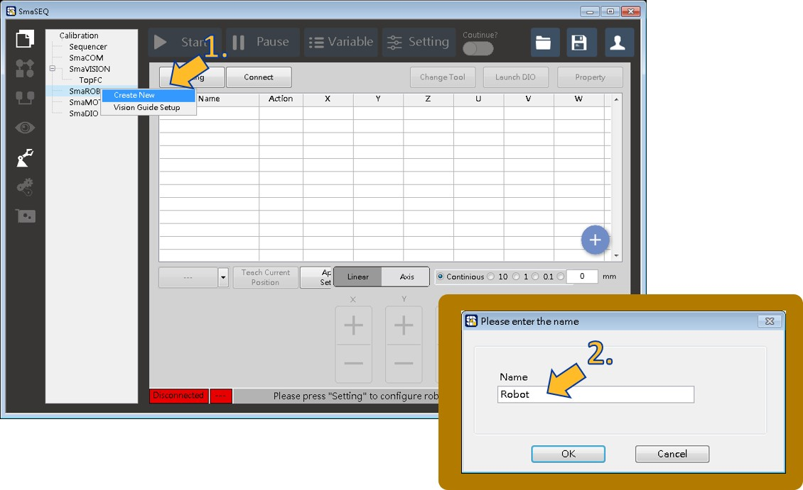
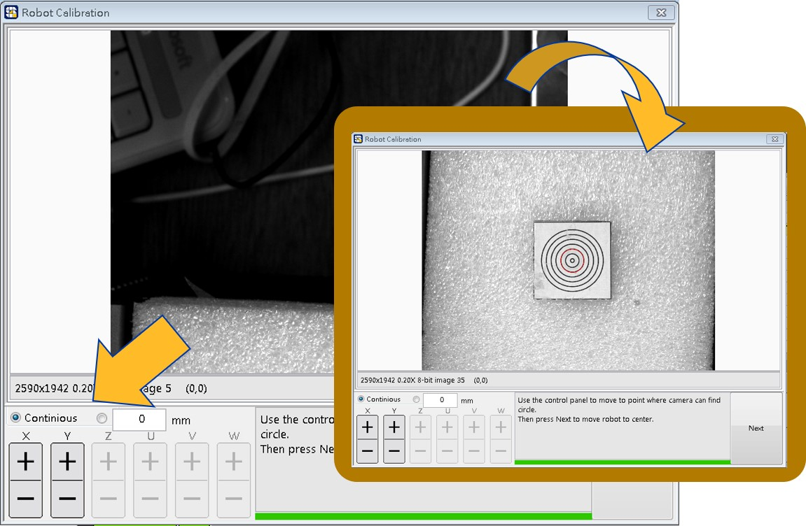
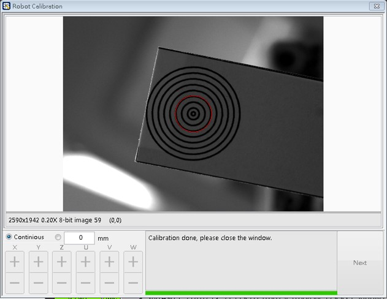

# 建立手臂與相機的座標關係模型

### 目標：使用 SmaROBOT 的 Vision Guide 功能，搭配視覺校正模組進行導引設定。

* 前置準備：查看相機的解析度


* 相機的解析度可用相機型號至官網查詢，或是在視覺模組的畫面視窗下方查看。
* 進行導引設定時，請務必確認手臂的拍照位置，U 軸需可以自由旋轉 180 度與 -180 度。

#### RobotCam 與 DownCam 的視覺導引流程是相同的。


## 建立或開啟手臂模組

#### 建立（開啟）要進行視覺導引的手臂模組

1. 右鍵點擊 SmaROBOT，選擇 Create New。
2. 為手臂模組命名。

#### 連線手臂

1. 點擊 Setting 按鈕進行手臂連線設定。
2. 點擊 Connect 按鈕連線手臂。
3. 移動手臂至拍照位置，並將此位置記錄為拍照座標點位。


* 導引設定完成後，往後的視覺導引拍照位置必須保持在同一個 Z 軸高度。
* 若進行 DownCam 視覺導引設定，請注意拍照位置的 U 軸角度需為 0 度。


#### 開啟視覺導引設定

1. 在欲建立視覺導引的 SmaROBOT 模組上，點擊右鍵，選擇「Vision Guide Setup」。
2. 在導引資訊管理視窗（Manage Calibration）上，右鍵點擊空白處，選擇「Launch Calibration」。

## 進入視覺導引設定程序

#### 在視覺導引設定中填入必要資訊

1. 填入參數
   * Name：命名此座標關係模型。
   * Type：選擇視覺導引的項目（RobotCam / DownCam）。
   * Initial Offset：設定手臂初始位移 X 方向的距離。
   * Rotate Angle：設定校正過程中的 U 軸旋轉方向（+/- 180）。
   * Vision Project：選擇要用以進行視覺導引設定的視覺模組。
   * Cam Width / Cam Height：相機的 X / Y 解析度。
2. 確認填入資訊正確後，按下 OK 進入視覺導引程序

#### 跟著視覺導引程序的引導進行操作

* **Step 1**

1. 若找圓成功，畫面會將以紅色圓框標示圓位置。
2. 點擊Next，手臂會往 X 軸正方向移動一段已設定的距離。

* **Step 2**

1. X 軸移動完畢後，畫面將標示圓點位置。
2. 點擊Next，手臂會移動位置，使圓點在畫面中心。

* **Step 3**

1. 移動完畢後，畫面將標示圓點位置。
2. 點擊Next，手臂將依指定方向旋轉 +/- 180度（請留意手臂周遭是否允許此動作）。

* **Step 4**

1. 旋轉後，程式會要求使用者操作手臂，使圓點再次回到畫面中（盡量使物品在畫面中間）。
2. 點擊Next，手臂會移動位置，使目標位於影像中心。

* **Step 5**

1. 移動完畢後，畫面將標示圓點位置。
2. 點擊Next，手臂將反轉 +/- 180度，並回到旋轉前位置。

* **Step 6 - 完成**

