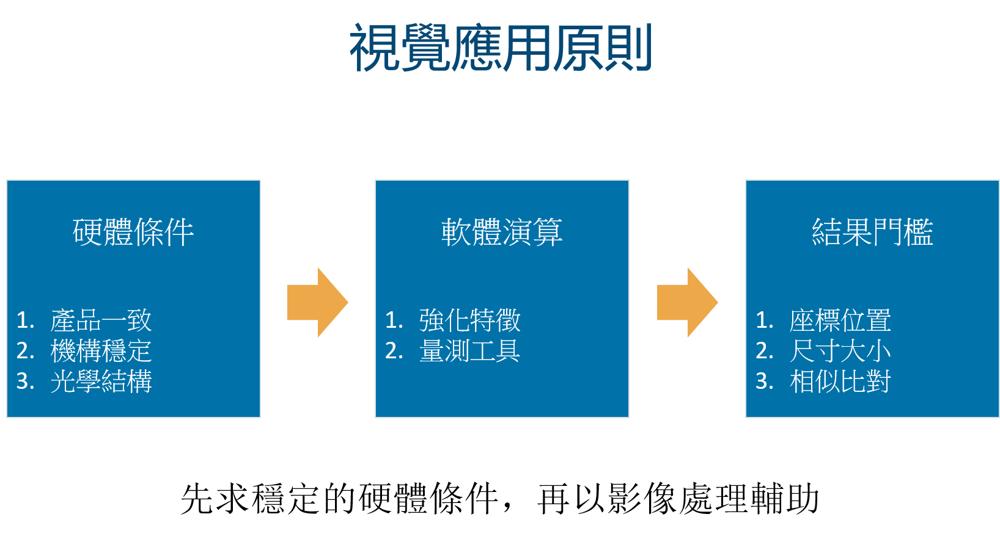
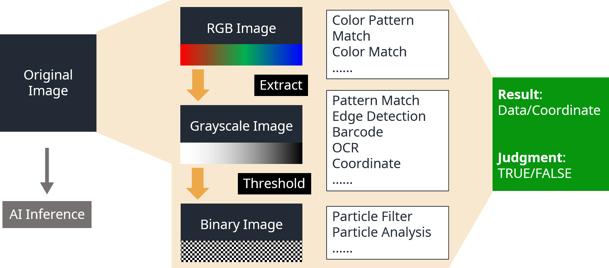

# 基礎影像應用概念

#### 機器視覺常是自動化工業中常見的一環，包含多樣的光學概念與演算法，有些基本原則的概念，可幫助我們在應用的開發上更加順利。

## AI 視覺檢測應用

請參考 Smasoft 開發的 SmaAI 解決方案。

## Rule-Based AOI 視覺檢測應用的原則

### 硬體

#### 1. 產品之特徵點或檢測項，必須具有相當的一致性

* 影像處理程序之可重複性，是機器視覺自動化應用的基礎，因此產品的形狀、色澤、圖案等，必須具備相當程度的一致性。

#### 2. 硬體架構須具備足夠的穩性性

* 硬體架構應保持穩定可靠，且選用適當畫素之相機

#### 3. 根據不同的應用，選擇相對適合的光學架構

* 若能正確選擇適當的光源，將大幅提升檢測的準確率，也能降低影像前處理的困難度

### 軟體

#### 1. 選擇影像特徵強化工具

* 影像常會帶有雜訊，或是特徵不夠明顯，此時便要輔以影像前處理工具，強化其特徵。

#### 2. 選擇量測工具

* 針對不同的應用，應選擇相對應的演算方法。例如: 圖案匹配、缺陷檢測、尺寸量測等。

#### 3. 添加判斷邏輯

* 依照需求，制定長度、數量、座標、配對分數等門檻。

## 影像的基本概念與分類

不同的影像的格式，有各自專屬的影像演算工具，我們應針對視覺檢測的項目，評估要使用 RGB、Grayscale 或是 Binary 的影像，再使用對應的演算方法，進行視覺專案的開發。

